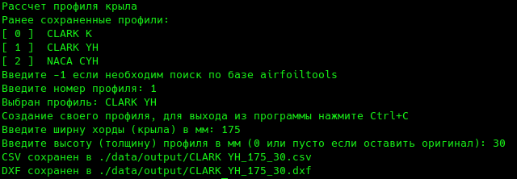

# Расчет профиля крыла модели

Программа создана с целью облегчить построение профиля крыла модели.  
В чем суть облегчения - при использовании плоттера с сайта airfoiltools или програмы Profili 2.0 нужно высоту профиля указывать в процентах, что не очень удобно.
Здесь все данные вводятся в мм, на выходе готовый профиль в CSV и DXF.  
CSV нужен для построения сплайна по точкам (Компас 3Д - сплайн по точкам - загрузить из файла), в таком варианте профиль получается более плавный.

Данные по профилям берутся с сайта airfoiltools.com
Можно загружать свои вручную в папку data/airfoil, формат файлов [lednicer](http://airfoiltools.com/airfoil/index) с расширением .dat   

При первом запуске программа создаст папку data рядом с собой. В папке хранятся данные по профилям и сгенерированные профили.  
Программа консольная, установки не требует.

  

Для завершения работы нажмите Ctrl+C или просто зайкройте программу. Сама она завершится только в случае ошибки. После выбора профиля будет бесконечный цикл по построению изменныех профилей. Так можно быстро сделать набор на все крыло.
